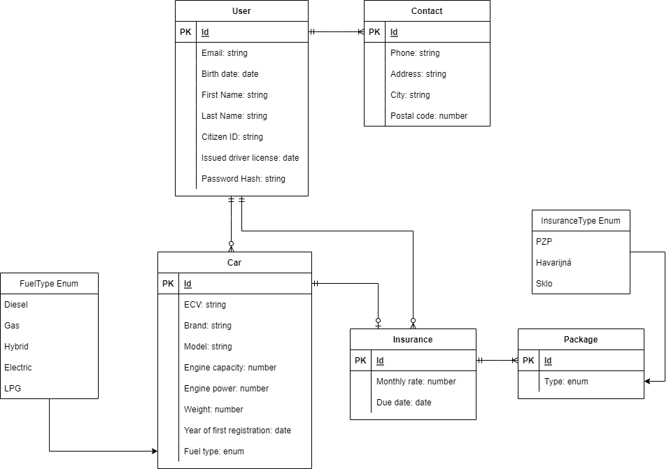

This folder contains backend files.
Provides database and API services to frontend.

# Running

| Command          | Purpose          |
| ---------------- | ---------------- |
| `npm run dev` | Starts in dev mode, automatic rebuild. |
| `npm run gendoc`| Builds swagger docs. |
| `npm run dev-gendoc` | Builds docs and runs dev. |
| `npm run prod` | Runs server in prod mode, without swagger. |

Server runs on port 3001 by default.
Swagger documentation is available at the endpoint `/swagger/`.

# ERD Diagram

